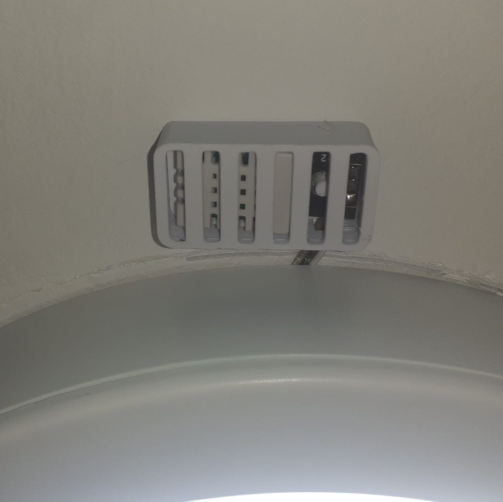
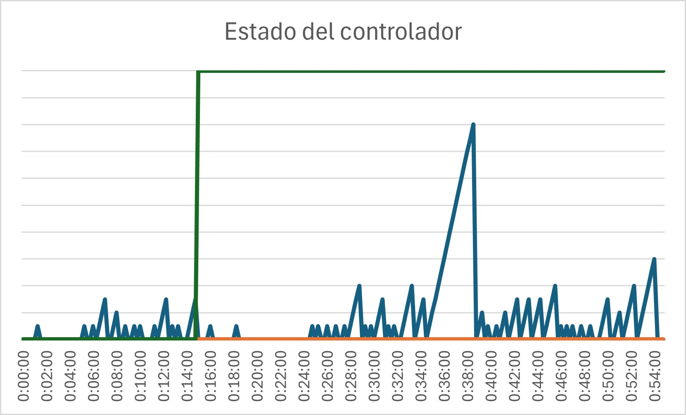
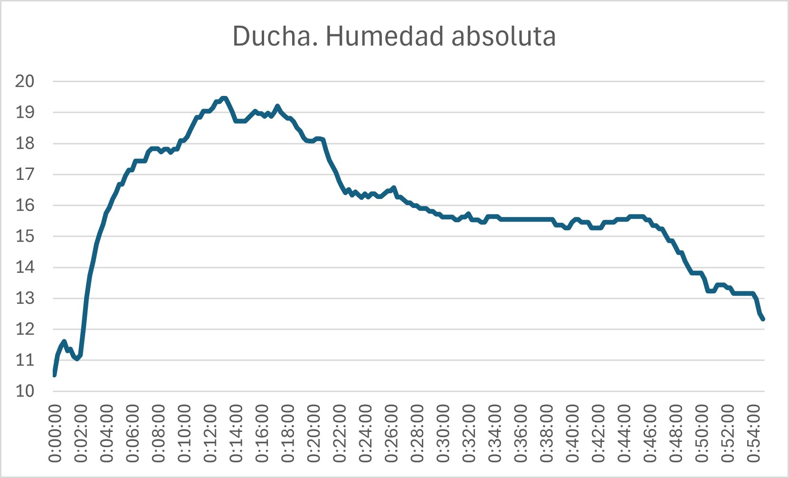
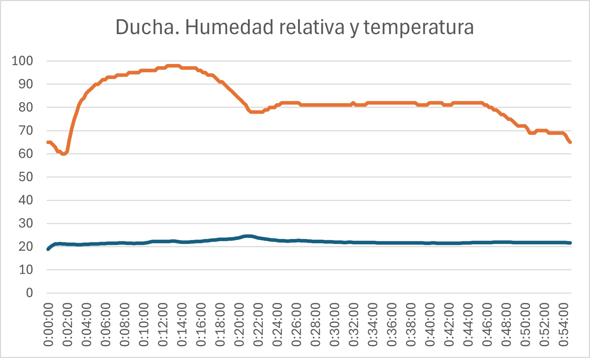

# Índice

- Diseño
- Instalación
- Resultado
- Limitaciones y posibles mejoras

## Controlador autónomo para extractor de humedad

Este proyecto nació a partir de un problema muy común en los baños domésticos. Los extractores de humedad suelen conectarse en paralelo con el alumbrado principal, de modo que se activan automáticamente cada vez que alguien enciende la luz. Aunque es una solución sencilla, tiene un inconveniente evidente: el extractor funciona siempre, independientemente de si realmente es necesario.

En mi caso decidí modificar la instalación para que el extractor pudiera accionarse manualmente mediante un interruptor independiente, sustituyendo el interruptor simple existente por uno doble.

La siguiente mejora consistió en instalar un relé temporizado a la desconexión ajustado a 30 minutos. Esto resolvía el problema de olvidarse de apagar el extractor, pero introducía otro distinto: un tiempo fijo rara vez es el adecuado. En ocasiones el baño recuperaba unas condiciones normales en pocos minutos y el extractor continuaba funcionando innecesariamente. En otras, tras una ducha prolongada, treinta minutos resultaban insuficientes para eliminar la humedad.

El objetivo pasó entonces a ser desarrollar un temporizador cuya duración dependiese del estado real del ambiente y no únicamente del tiempo transcurrido.

El proyecto consiste en el diseño de un controlador basado en Arduino capaz de gestionar automáticamente un extractor de humedad utilizando medidas de temperatura y humedad. El sistema mantiene el extractor en funcionamiento el tiempo necesario para reducir la humedad ambiental por debajo de unos umbrales configurables, evitando tanto un funcionamiento insuficiente como un consumo innecesario.

### Diseño

Desde el principio se priorizó la robustez del sistema frente a la complejidad. Los sensores de humedad de bajo coste tienden a producir lecturas erróneas, quedar bloqueados o incluso dejar de responder, especialmente en ambientes cálidos y húmedos como un cuarto de baño. Esto es especialmente relevante en condiciones en las que la humedad tiene a condensar (es decir, que el sensor se encuentre a temperatura de rocío). Por ese motivo el controlador se diseñó siguiendo un principio sencillo: ante cualquier condición anómala, el sistema debe adoptar un comportamiento predecible y seguro.

Para conseguirlo se implementaron distintos mecanismos de protección:

* filtrado de medidas mediante mediana (elimina outliers)
* detección de valores fuera de rango (elimina lecturas erróneas pero validadas por el sensor)
* detección de sensor congelado (mide el tiempo de respuesta del sensor para detectar degradación)
* recuperación automática mediante watchdog (incluye aviso por reinicio automático)
* modo seguro ante fallos persistentes (intento de recuperación; en caso de fallo persistente, apagado automático)
* apagado definitivo cuando no puede garantizarse un funcionamiento fiable (o cuando termina el ciclo de funcionamiento)

El esquema de la máquina de estados está disponible aquí: [Máquina de estados](docs/Programa_Arduino_(UML).pdf)
El programa completo para Arduino IDE está en: [Programa](firmware/Extractor_humedad/Extractor_humedad.ino)

Además, el sistema nunca sustituye el control manual del usuario. El extractor continúa estando gobernado en última instancia por el interruptor de la instalación, de modo que siempre puede desconectarse manualmente independientemente del estado del controlador.

#### Instalación

El proyecto se integra aprovechando la instalación existente. La fuente de alimentación se encuentra en la caja de derivación del circuito de alumbrado. El controlador (Arduino y relé) está instalado sobre el falso techo, aprovechando el hueco del foco del baño. El sensor DHT22 está situado junto al punto de luz para medir la humedad ambiente. Debe colocarse lo más cerca posible del controlador para evitar ruido eléctrico (el protocolo one-wire es sensible a cables muy largos).  El extractor permanece conectado al interruptor manual existente, utilizándose el controlador únicamente para automatizar su desconexión. Ambos controladores (interruptor y relé) están conectados en serie, de forma que es necesario que ambos coincidan para el encendido, pero cualquiera de los dos puede apagarlo. Hay un esquema eléctrico adjunto. El objetivo fue integrar el sistema sin modificar la apariencia del baño ni añadir elementos visibles, con la única excepción del sensor de humedad relativa y temperatura, que, por su funcionamiento, debe quedar a la vista.
El esquema de la instalación eléctrica está disponible aquí: [Esquema](docs/Esquema_de_instalación.pdf)

### Resultado

El comportamiento obtenido es considerablemente más natural que el de un temporizador convencional. El extractor permanece funcionando únicamente el tiempo necesario para reducir la humedad y se adapta automáticamente a la duración e intensidad de cada uso del baño. Aunque se trata de un proyecto doméstico, se diseñó aplicando criterios habituales en sistemas embebidos, prestando especial atención a la gestión de errores, la robustez y la seguridad de funcionamiento.

Los resultados están recogidos en la hoja de cálculo adjunta: [Hoja de resultados](data/Data.xlsx)
En ésta se muestran los siguientes datos:

* En el primer libro, dos pruebas en condiciones idénticas. Una de ellas (prueba A) muestra la evolución de la humedad con ventilación natural. La otra (prueba B) muestra la evolución en las mismas condiciones, esta vez con el extractor funcionando. Ambas pruebas terminan cuando los valores de humedad son aceptables (el mismo valor para ambas pruebas). Las condiciones iniciales de ambas pruebas están disponibles en [Condiciones iniciales](docs/Metodología_para_la_prueba.txt)
* En el segundo libro, una ducha real en condiciones convencionales. Se muestran, además de la evolución de las humedades relativa y absoluta y la evolución de la temperatura, el estado del controlador. Esta gráfica incluye número de errores, de lecturas repetidas y estado de la máquina de estados (esperando o evaluando).
* En el tercer libro, de nuevo, una ducha real, esta vez tras unas semanas de uso. En este caso, el controlador se vio obligado a retornar a la etapa de espera tras detectar un aumento de humedad. Se aprecian también en este ejemplo los errores del sensor. Durante esta prueba, 10 de los 130 ciclos de medición presentaron al menos una lectura no válida (7,69 % de los ciclos). Dado que cada ciclo se compone de seis lecturas de sensor independientes, la probabilidad estimada de que una lectura individual falle es de aproximadamente el 1,3 %.

Para transformar los datos del controlador en información interpretable por Excel, hay un script de Python que transforma documentos de texto con el formato de la salida del monitor serie en documentos tipo csv. [Script](scripts/Serial_to_csv.py)

#### Limitaciones y posibles mejoras

* Utiliza un DHT22, que no es un sensor industrial.
* El Arduino Nano no es la plataforma definitiva para un producto comercial.
* No existe registro histórico de datos.
* Los umbrales son configurables únicamente modificando el firmware.

#### Ideas

* PCB diseñada específicamente para el proyecto.
* Sensor SHT31 o BME280.
* Configuración mediante Bluetooth o Wi-Fi.
* Actualización OTA (en caso de migrar a ESP32).
* Algoritmo adaptativo según estación del año.
